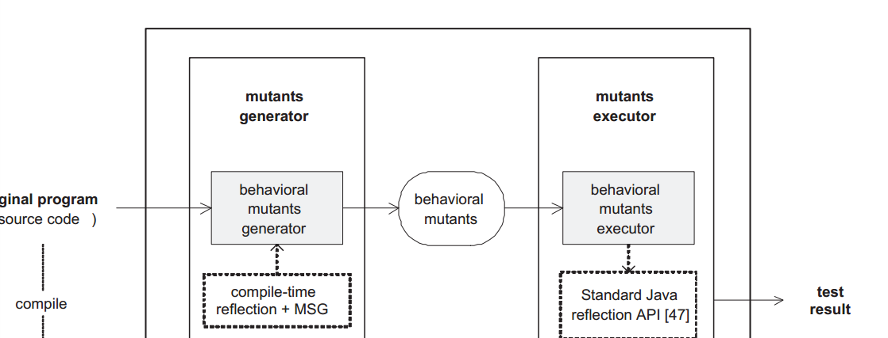

# Cmujava的设计与实现
基于Barbury提出的25中变异算子，我们开发了一个...的系统。接下来详细讨论Cnujava的设计
与实现的关键问题。

## Cmujava的基本原理

在生成变异体时要考虑生成变异体的速度（论文中有关于这方面的叙述）。传统的方法。。。。提高生成变异体的速度是必要的。

MSC是一种。。。。的技术，通过。。。。

反射技术。。。。。。。

本文利用MSG和反射技术。。。。。其框架如图（论文的Figure 2）。描述这个图

## Cmujava的设计

思路：将mujava的模块抽取出来结合上两节的框架，将主要部件体现出来。

## Cmujava实现的关键问题

这个时候我觉得可以介绍一下visitor设计模式
